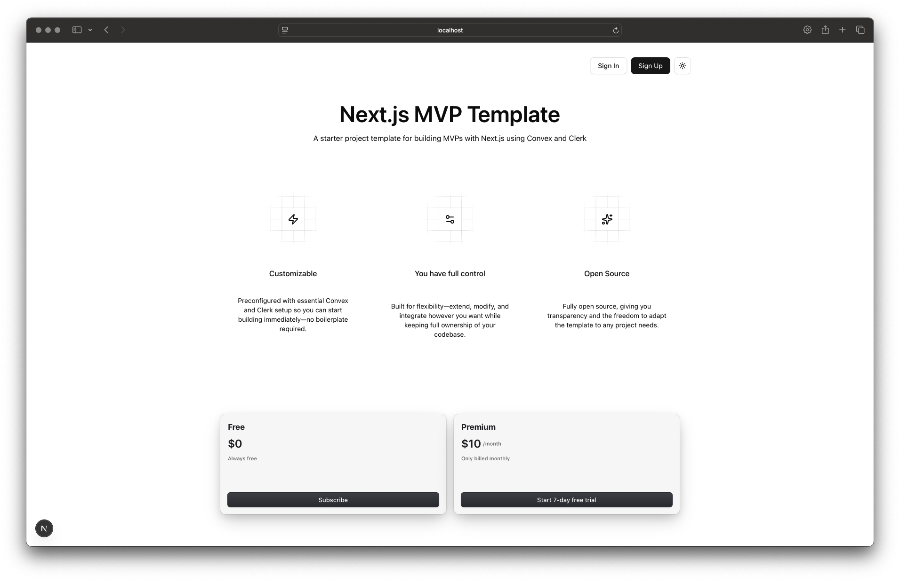

# Convex + Clerk Next.js Starter



A modern SaaS boilerplate that combines **Next.js 16**, **Clerk authentication**, and **Convex real-time data**, enabling you to launch dashboards, billing flows, and synced user records with minimal setup.

## Features

- ✅ Pre-wired Clerk auth (UI + JWT templates) with Convex validation
- ✅ Convex schema + mutations to keep a `users` table synced via Clerk webhooks
- ✅ HTTP endpoint (`/clerk-users-webhook`) that verifies Svix signatures
- ✅ Shared React provider (`ConvexProviderWithClerk`) for safe Convex hooks
- ✅ Tailwind-ready UI primitives, theme toggling, and placeholder public/dashboard routes

See `docs/setup.md` for the full walk-through.

## Tech Stack

- [Next.js App Router](https://nextjs.org/) (Turbopack dev server)
- [Clerk](https://clerk.com/) for auth UI and JWT issuance
- [Convex](https://convex.dev/) for data, server functions, and webhooks
- [Tailwind CSS](https://tailwindcss.com/) + [shadcn/ui](https://ui.shadcn.com/) components
- [pnpm](https://pnpm.io/) for dependency management

## Getting Started

1. Install the necessary packages by executing the command below;

```bash
pnpm install
```

2. After installing the dependencies, we need to configure clerk and convex by following this guide [here](https://docs.convex.dev/auth/clerk#nextjs) which will help you get started with handling Clerk and Convex, make sure to copy the environment variables and create a `.env.local` to store it locally

3. Once the Convex and Clerk environment variables are saved in `.env.local`, we need to set up the webhook. Go to the [HTTP File](convex/http.ts) and copy the path (`/clerk-users-webhook`) then append it to your `NEXT_PUBLIC_CONVEX_URL`, and change `.cloud` to `.site`, resulting in something like this `https://..x.convex.site/clerk-users-webhook`. after obtaining that value, you can paste it into the Clerk webhook settings

4. Make sure you have updated the Convex environment variables; they should include `CLERK_JWT_ISSUER_DOMAIN` `CLERK_WEBHOOK_SECRET` setup there

5. After configuring both Clerk and Convex, you can run

```bash
pnpm convex:dev
pnpm dev
```

Open http://localhost:3000 to view the public marketing page. Use the Clerk modal to sign in. Convex verifies the JWT, saves user details via the webhook, and enables you to begin querying the synced records for dashboards.

## Useful Scripts

| Command           | Description                                     |
| ----------------- | ----------------------------------------------- |
| `pnpm dev`        | Start Next.js (Turbopack).                      |
| `pnpm build`      | Production build.                               |
| `pnpm start`      | Run the built Next.js app.                      |
| `pnpm lint`       | ESLint.                                         |
| `pnpm convex:dev` | Start Convex dev server + hot reload functions. |

## Documentation

- [Setup Guide](docs/setup.md)
- [Clerk Next.js Quickstart](https://clerk.com/docs/nextjs/getting-started/quickstart)
- [Convex Clerk Auth](https://docs.convex.dev/auth/clerk#nextjs)
- [Convex Database Schemas](https://docs.convex.dev/database/schemas)

## Contributing / Customizing

1. Fork or clone the repo.
2. Update `convex/schema.ts` and run `pnpm convex:dev` to sync schema.
3. Extend `convex/users.ts` with more metadata (roles, billing state, etc.).
4. Build dashboard routes under `app/(dashboard)/`.
5. Add billing integrations (Stripe, Lemon Squeezy, etc.) – place hooks in Convex actions/mutations for a unified backend.

Pull requests are welcome! This template is meant to stay lean but pragmatic; If something slows down your setup, feel free to improve it and share.
